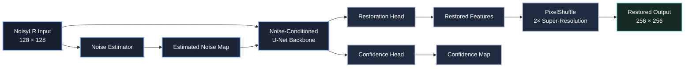
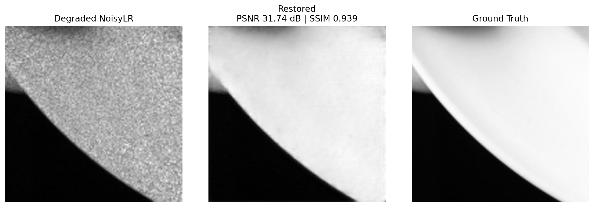
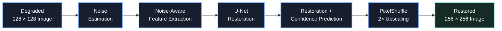

<div align="center">

# KLA Image Restoration & Super-Resolution

### Noise-Aware Deep Learning for Semiconductor Image Enhancement

**Team Name: [YOUR TEAM NAME]**

KLA Hackathon 2026 — PS01

</div>

---

## Overview

This project presents a lightweight deep-learning pipeline for restoring degraded semiconductor images.

The model performs two tasks jointly:

- Noise suppression
- 2× image super-resolution

The network converts a degraded **128×128 NoisyLR image** into a restored **256×256 image** while preserving structural information.

---

## Model Architecture



The architecture first estimates the degradation present in the low-resolution input. The estimated noise information conditions the U-Net restoration backbone. The network then produces restoration and confidence outputs before applying PixelShuffle for 2× spatial upscaling.

---

## Validation Results

The trained model was evaluated on **320 validation images**.

<div align="center">

| Metric | Result |
|:---|:---:|
| **PSNR** | **27.01 dB** |
| **SSIM** | **0.7212** |
| **LPIPS** | **0.3119** |

</div>

### Example Restoration

<div align="center">



</div>

The comparison shows the degraded NoisyLR input, the restored model output, and the corresponding ground-truth image.

---

## Inference Performance

Inference performance was measured on an **NVIDIA Tesla T4 GPU** after GPU warm-up.

<div align="center">

| Performance Metric | Measured Result |
|:---|:---:|
| **Mean Inference Time** | **9.33 ms/image** |
| **Median Inference Time** | **6.89 ms/image** |
| **Throughput** | **107.13 FPS** |
| **Model Parameters** | **~2.77M** |

</div>

> **Note:** These inference measurements were obtained on an NVIDIA Tesla T4 GPU and do not represent performance on the official KLA H100 evaluation environment.

---

## Processing Pipeline



---

## Technology Stack

<div align="center">

| Component | Technology |
|:---|:---|
| **Deep Learning Framework** | PyTorch |
| **Programming Language** | Python |
| **GPU Environment** | NVIDIA Tesla T4 |
| **Image Processing** | NumPy |
| **Perceptual Evaluation** | LPIPS |
| **Version Control** | Git / GitHub |

</div>

---

## Dataset

The dataset contains paired semiconductor images:

```text
train/
│
├── GT/
│   ├── 000000.npy
│   ├── 000001.npy
│   └── ...
│
└── NoisyLR/
    ├── 000000.npy
    ├── 000001.npy
    └── ...
```

| Dataset Property | Value |
|:---|:---:|
| Ground Truth Images | 3200 |
| NoisyLR Images | 3200 |
| NoisyLR Resolution | 128 × 128 |
| Ground Truth Resolution | 256 × 256 |
| Upscaling Factor | 2× |

---

## Repository Structure

```text
Arshiya_KLA_PS01/
│
├── README.md
├── requirements.txt
├── kla_best_model.pt
│
├── src/
│   └── ...
│
└── outputs/
    └── KLA_real_restoration.png
```

---

## Trained Model

The repository includes the trained model weights:

```text
kla_best_model.pt
```

The final checkpoint corresponds to the model selected using validation performance after **10 training epochs**.

---

## Key Features

- Joint image denoising and 2× super-resolution
- Noise-aware restoration architecture
- Dedicated noise-estimation module
- U-Net-based restoration backbone
- Confidence prediction branch
- PixelShuffle-based upscaling
- Approximately **2.77 million parameters**
- GPU inference at approximately **107 FPS** on Tesla T4
- Quantitative evaluation using PSNR, SSIM, and LPIPS

---

## Final Performance Summary

<div align="center">

| PSNR | SSIM | LPIPS | Throughput |
|:---:|:---:|:---:|:---:|
| **27.01 dB** | **0.7212** | **0.3119** | **107.13 FPS** |

</div>

---

<div align="center">

### KLA Hackathon 2026 — PS01

**Team [YOUR TEAM NAME]**

</div>
